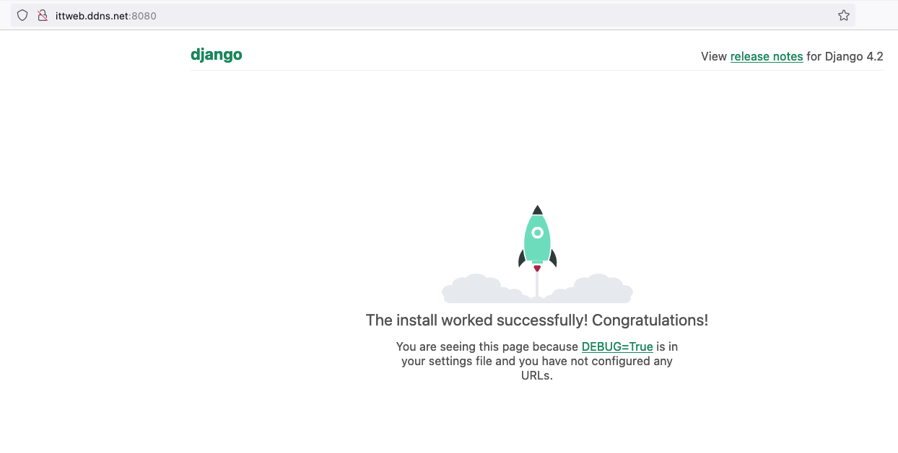

# Primeros pasos con django

## Instalación

*Se asume que estamos en una instancia de ubuntu 24.04*

```
lsb_release -a

Distributor ID:	Ubuntu
Description:	Ubuntu 22.04.3 LTS
Release:	22.04
Codename:	jammy
```

Como primer paso vamos a crear un [ambiente virtual de Pyhton] (https://docs.python.org/3/tutorial/venv.html).
El ambiente virtual va a crear un directorio con los archivos necesarios para ejecutar 
una instalación de Python independiente. Este ambiente lo puedes utilizar en varios proyectos 
que tengan requerimientos similares. El directorio debe quedar fuera del control de versiones así
que asegurate que esté en tu `.gitignore` en caso de tener el directorio del ambiente dentro de 
tu repositorio local. En este caso el ambiente estará en nuestro directorio `HOME` y se llamará `django-venv`.

```
python3 -m venv django-venv
```

Una vez creado el ambiente lo activamos:

```
source django-venv\bin\activate  
```

Para desactivarlo simplemente ejecutamos el comando `deactivate`. Dependiendo del 
*theme* de tu terminal, es común que se indique en el prompt que el ambiente está activado:

```
(django-venv) ubuntu@ip:~$
```

Una vez activado el ambiente vamos a instalar django utilizando pip:
```
pip install django
```

Podemos ver que liberías están instaladas en el ambiente con el comando freeze:
```
pip freeze
(salida)
asgiref==3.7.2
Django==4.2.6 
sqlparse==0.4.4
typing_extensions==4.8.0
```

Revisa que esté instalada la librería de Django.
Para volver a instalar las librerías que tenemos hasta ahora podemos almacenar la
salida del comando `freeze` en un archivo llamado `requeriments.txt`:
```
pip freeze > requirements.txt
```
En otro momento, podemos instalar las librerías de esta manera:

**No es necesario hacerlo en este momento** 
```
pip install -r requirements.txt
```

## Cómo crear un projecto 
Para crear un proyecto desde cero (en este caso llamado **mymovies**)
ejecutamos el siguiente comando:
```
django-admin startproject mymovies
```

Para ver la estructura del directorio que acabamos de crear podemos ejecutar el
comando `tree` (debemos primero instalarlo con `sudo apt install tree`) 
```
tree mymovies
(salida)
mymovies/
├── manage.py
└── mymovies
    ├── __init__.py
    ├── asgi.py
    ├── settings.py
    ├── urls.py
    └── wsgi.py
```

Como vamos a estar probando a nuestro proyecto de manera remota utilizando 
una IP pública, necesitamos agregar esta IP (o host) al parámetro de configuración `ALLOW_HOSTS` 
en `settings.py`:

```python
ALLOWED_HOSTS = ['otro.host.com', 'web.ddns.net']
```

Una vez creado el proyecto podemos probar la instalación ejecutando el 
servidor web de desarrollo incluido en django. En este caso especificamos 
el parámetro `0.0.0.0:8000` para poder acceder al servidor desde internet en el 
puerto `8000`:

```
(django-venv) ubuntu@ip-172-31-57-104:~/mymovies$ python3 manage.py runserver 0.0.0.0:8000
```

Salida:

```
Watching for file changes with StatReloader
Performing system checks...

System check identified no issues (0 silenced).

You have 18 unapplied migration(s). Your project may not work properly until you apply the migrations for app(s): admin, auth, contenttypes, sessions.
Run 'python manage.py migrate' to apply them.
October 05, 2023 - 16:08:33
Django version 4.2.6, using settings 'mymovies.settings'
Starting development server at http://0.0.0.0:8000/
Quit the server with CONTROL-C.
```

Prueba acceder desde tu navegador. Recuerda que debes tener abierto al tráfico el puerto `8000` en tu grupo de seguridad o firewall.

Al intentar conectarnos por `https` se interrumpe la conexión pues no es posible conectarnos por https en este momento.

```
[05/Oct/2023 16:17:00] code 400, message Bad HTTP/0.9 request type ('\x16\x03\x01\x02\x92\x01\x00\x02\x8e\x03\x03/º\x10=N')
[05/Oct/2023 16:17:00] You're accessing the development server over HTTPS, but it only supports HTTP.
```

Recuerda conectarte (por el momento)  por `http` únicamente.

Si todo sale bien debemos de ver la página siguiente:



## Vamos agregando una nueva aplicación

En django, un proyecto web consiste en una estructura de archivos de configuración (la cual acabamos de crear) y una o varias
aplicaciones que implementan cierta funcionalidad. Esto nos permite reutilizar una aplicación (su funcionalidad) en varios 
proyectos. Para crear nuestra aplicación (en este caso llamada *movies*) ejecutamos el siguiente comando:

```
(django-venv) ubuntu@ip-172-31-57-104:~/mymovies$ python3 manage.py startapp movies
```

Veamos la estructura

```
(django-venv) ubuntu@ip-172-31-57-104:~/mymovies$ tree .
.
├── db.sqlite3
├── manage.py
├── movies
│   ├── __init__.py
│   ├── admin.py
│   ├── apps.py
│   ├── migrations
│   │   └── __init__.py
│   ├── models.py
│   ├── tests.py
│   └── views.py
└── mymovies
    ├── __init__.py
    ├── __pycache__
    │   ├── __init__.cpython-310.pyc
    │   ├── settings.cpython-310.pyc
    │   ├── urls.cpython-310.pyc
    │   └── wsgi.cpython-310.pyc
    ├── asgi.py
    ├── settings.py
    ├── urls.py
    └── wsgi.py

4 directories, 18 files
```

Vemos que el directorio `movies` incluye archivos donde vamos a agregar la funcionalidad de nuestro sitio.
Es importante agregar a `.gitignore` también los archivos compilados de Python `*.pyc`

## ORM de Django

Vamos a iniciar nuestro proyecto definiendo el esquema de la base de datos relacional para nuestra aplicación.
Para esto debemos editar el archivo models.py:

Una vez que hemos agregado algunas clases `models.py` podemos agregar nuestra app 
al proyecto. Esto lo hacemos en el archivo `settings.py`

```python
INSTALLED_APPS = [ 'movies.apps.MoviesConfig', 
    'django.contrib.admin',
] 
```


